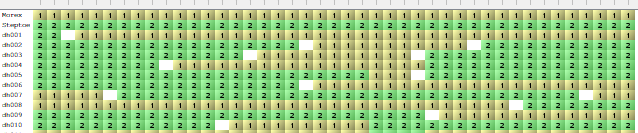

```{r setup, include = FALSE}
knitr::opts_chunk$set(
  collapse = TRUE,
  comment = "#>",
  fig.dim = c(7, 4)
)
library(statgenIBD)
op <- options(width = 90)
```

## The statgenIBD package {-}

The `statgenIBD` package is developed as an easy-to-use package for Identity By Descent (IBD) calculations for most common populations used in plant breeding. The calculations of the IBDs are based on Hidden Markov Models (HMM) and inheritance vectors. For details of the theory see @Lander1987 and @Huang2011.

This vignette describes how to perform these calculations and how to interpret and use its outputs. This will be done using a number of example data sets, both real life and simulated.

## Population types

In the package, IBD probabilities can be calculated for many different types of populations. In the following table all supported populations are listed. Note that the value of x in the population types is variable, with its maximum value depicted in the last column.

+---------------------+------------+------------------------------------------------------------+------------+
| **Population type** | **Cross**  | **Description**                                            | **max. x** |
+=====================+============+============================================================+============+
| DH                  | biparental | doubled haploid population                                 |            |
+---------------------+------------+------------------------------------------------------------+------------+
| Fx                  | biparental | Fx population (F1, followed by x-1 generations of selfing) | 8          |
+---------------------+------------+------------------------------------------------------------+------------+
| FxDH                | biparental | Fx, followed by DH generation                              | 8          |
+---------------------+------------+------------------------------------------------------------+------------+
| BCx                 | biparental | backcross, second parent is recurrent parent               | 9          |
+---------------------+------------+------------------------------------------------------------+------------+
| BCxDH               | biparental | BCx, followed by DH generation                             | 9          |
+---------------------+------------+------------------------------------------------------------+------------+
| BC1Sx               | biparental | BC1, followed by x generations of selfing                  | 7          |
+---------------------+------------+------------------------------------------------------------+------------+
| BC1SxDH             | biparental | BC1, followed by x generations of selfing and DH           | 6          |
+---------------------+------------+------------------------------------------------------------+------------+
| C3                  | three-way  | three way cross: (AxB) x C                                 |            |
+---------------------+------------+------------------------------------------------------------+------------+
| C3DH                | three-way  | C3, followed by DH generation                              |            |
+---------------------+------------+------------------------------------------------------------+------------+
| C3Sx                | three-way  | C3, followed by x generations of selfing                   | 7          |
+---------------------+------------+------------------------------------------------------------+------------+
| C3SxDH              | three-way  | C3, followed by x generations of selfing and DH generation | 6          |
+---------------------+------------+------------------------------------------------------------+------------+
| C4                  | four-way   | four-way cross: (AxB) x (CxD)                              |            |
+---------------------+------------+------------------------------------------------------------+------------+
| C4DH                | four-way   | C4, followed by DH generation                              |            |
+---------------------+------------+------------------------------------------------------------+------------+
| C4Sx                | four-way   | C4, followed by x generations of selfing                   | 6          |
+---------------------+------------+------------------------------------------------------------+------------+
| C4SxDH              | four-way   | C4, followed by x generations of selfing and DH generation | 6          |
+---------------------+------------+------------------------------------------------------------+------------+

For IBD calculations of more complex population types, including MAGIC and population with complicated pedigree structure, see [RABBIT](https://github.com/chaozhi/RABBIT) software [@Zheng2014; @Zheng2015; @Zheng2018].

## Examples

We will demonstrate the basic functionality of the package using some example data sets. The first example will be for a real life data set for a relatively simple doubled haploid population. To highlight some specifics of more complex populations and crosses, we will use simulated data.

### Steptoe Morex

The first example is the Steptoe Morex data, described by [@Hayes1993]. This is a population of 150 barley doubled haploid lines with parentage Steptoe / Morex. The population was developed for the North American Barley Genome Mapping Project by the Oregon State University Barley Breeding Program. For a full description see the [website](https://wheat.pw.usda.gov/ggpages/SxM/) of the program.

The map and genotypic file for this population are included in the package.

Both the map and the genotypic file should be in a **tab**-delimited format. The map file should be a file without a header. It should contain three columns, corresponding to marker name, chromosome number and position on the chromosome in centiMorgan.

```{r inspectMap}
## Read the map and display the first rows.
map <- read.table(system.file("extdata/SxM", "SxM_map.txt", package = "statgenIBD"))
head(map)
```

The genotypic file should a file with a header containing the marker names. The first column should contain the genotypes, starting with the parents, in this case Morex and Steptoe. The name of this column is irrelevant and can even be an empty string as in this example.

The parents are assumed to be inbred lines, without missing scores. For this Steptoe x Morex example, the markers for Morex are all 1, Steptoe all 2. The original SNP data can also be used. Missing marker scores in the offspring should have value "-". More general, for populations with SNP scores *a* and *b* for the parents, the offspring can be scored as *a* (or *a/a), b* (or *b/b), a/b, a/-, -/b, or -.*

```{r inspectLoc}
## Read the genotypic file and display the first rows and columns.
geno <- read.table(system.file("extdata/SxM", "SxM_geno.txt", package = "statgenIBD"),
                   header = TRUE)
head(geno[, 1:5])
```

Using the map and genotypic files we can compute the IBD probabilities using `calcIBD`. This function computes, per genotype and marker, the probability that it descended from either parent. If this information is known for the marker from the input, the probabilities will simply be 0 for one of the parents and 1 for the other. When a marker score is missing from the input, the probabilities are calculated using the information of the other markers on the chromosome.

```{r sxmIBD}
## Compute IBD probabilities for Steptoe Morex.
SxMIBD <- calcIBD(popType = "DH",
                  markerFile = system.file("extdata/SxM", "SxM_geno.txt",
                                           package = "statgenIBD"),
                  mapFile = system.file("extdata/SxM", "SxM_map.txt",
                                        package = "statgenIBD"))

## Print summary.
summary(SxMIBD)
```

The output of the `calcIBD` function is an object of class `IBDprob`. This object is a `list` that consists of five elements:

+------------+--------------+--------------------------------------------------------------------------------------------------------------------------------------------------------------------------------------------------------------------------------------------------------+
| element    | class        | description                                                                                                                                                                                                                                            |
+============+==============+========================================================================================================================================================================================================================================================+
| map        | `data.frame` | The map for the population.                                                                                                                                                                                                                            |
+------------+--------------+--------------------------------------------------------------------------------------------------------------------------------------------------------------------------------------------------------------------------------------------------------+
| markers    | `array`      | A three dimensional array with the IBD probabilities. The dimensions of this array are \#markers x \#genotypes x \#parents. The array contains per combination of marker and genotypes the probabilities that it descended from either of the parents. |
+------------+--------------+--------------------------------------------------------------------------------------------------------------------------------------------------------------------------------------------------------------------------------------------------------+
| popType    | `character`  | The population type.                                                                                                                                                                                                                                   |
+------------+--------------+--------------------------------------------------------------------------------------------------------------------------------------------------------------------------------------------------------------------------------------------------------+
| parents    | `character`  | The parents.                                                                                                                                                                                                                                           |
+------------+--------------+--------------------------------------------------------------------------------------------------------------------------------------------------------------------------------------------------------------------------------------------------------+
| multiCross | `logical`    | An indicator showing whether in this `IBDprob` object multiple crosses where combined. This is always `FALSE` for the output of the `calcIBD` function, but will be `TRUE` when multiple crosses are combined as we will see in the examples.          |
+------------+--------------+--------------------------------------------------------------------------------------------------------------------------------------------------------------------------------------------------------------------------------------------------------+

The `summary` function can be used to get a short description of the content of a `IBDprob` object.

Looking at genotype **dh001** and marker **plc** we can see from the genotypic file printed above that it has a value of 2, equal to that of Steptoe. If we now look at the output of `calcIBD` it shows a value of 1 for pSteptoe and a value of 0 for pMorex.

```{r check_dh001_plc}
SxMIBD$markers["plc", "dh001", ]
```

For the combination of marker **abg313b** and genotype **dh005** the genotypic file contained a missing value. Looking at the output we can see that the probability that this marker came from Morex is about 0.67 and the probability that it came from Steptoe is about 0.33.

```{r check_dh005_abg313b}
SxMIBD$markers["abg313b", "dh005", ]
```

### Visualizing results

The calculated IBD probabilities can be visualized using the `plot` function. Three types of plot can be made using this function. `plotType = "pedigree"` will create a plot showing the pedigree of the population for which the IBD probabilities where computed. 

```{r plotsxmIBDped}
### Visualize the pedigree of the population.
plot(SxMIBD,
     plotType = "pedigree")
```

`plotType = "singleGeno"` will generate a plot of the probabilities per parent for a selected genotype. The plot for **dh005** is made below. Note that it contains a lot of white space since the markers in the file are spread widely along the genome. In the next section we will show how to compute probabilities on a denser grid.

```{r plotsxmIBD}
## Visualize IBD probabilities for dh005.
plot(SxMIBD, 
     plotType = "singleGeno",
     genotype = "dh005")
```

A second type of plot can be made specifying `plotType = "allGeno"`. This will generate a plot of all genotypes colored per evaluation position according to the parent with the highest probability for that combination of genotype and position. Darker colors indicate a higher probability. Dashed lines indicate the start of a new chromosome.

```{r plotsxmIBDAll}
## Visualize IBD probabilities for all genotypes.
plot(SxMIBD, 
     plotType = "allGeno",
     genotype = "dh005")
```

### Evaluation positions

When calling the `calcIBD` function without extra parameters, the only positions for which the calculations are made are the positions present in the map. There are two ways to change this. A first option is to specify the parameter `evalDist`. Setting this to a value of e.g. 5, assures that extra evaluation positions are added in such a way that the maximum distance between evaluation points will be 5 cM.

Adding the extra evaluation points can be done on a grid by setting `grid = TRUE`. Doing this defines a grid of evaluation points from the beginning of each chromosome to the end with a distance between the evaluation points of `evalDist`. The original marker positions will be ignored in this case. To use evaluation points on a regular grid is important for haplotype construction and is efficient for detection of QTLs [@VanEeuwijk2009].

```{r sxmIBD_extGrid}
## Compute IBD probabilities for Steptoe Morex.
## Add extra evaluation positions on dense grid.
SxMIBD_Ext_grid <- calcIBD(popType = "DH",
                           markerFile = system.file("extdata/SxM", "SxM_geno.txt",
                                                    package = "statgenIBD"),
                           mapFile = system.file("extdata/SxM", "SxM_map.txt",
                                                 package = "statgenIBD"),
                           evalDist = 1,
                           grid = TRUE)

## Print summary.
summary(SxMIBD_Ext_grid)
```

As the summary shows, the number of evaluation points has increased to 1138. This will also show when we visualize the results. The positions of the crossovers on the different chromosomes are clearly visible now.

```{r SxMIBD_Ext_grid}
## Visualize IBD probabilities for dh005
plot(SxMIBD_Ext_grid, 
     genotype = "dh005")
```

When setting `grid = FALSE` extra evaluation positions will be included between existing marker positions. These extra evaluation points will be spread evenly. If we look at the map for the Steptoe Morex example, we see that the distance between the first two markers on chromosome 1, **plc** and **glx**, is 18.7. To assure a maximum distance between evaluation points of 5, 3 extra evaluation points will be added. Since they will be spread evenly, the distance between them will be 18.7/3 = 4.68. The extra evaluation points will be named EXT_chr_pos, e.g the extra evaluation point at position 4.68 of chromosome 1, will be named EXT_1\_4.68.

```{r sxmIBD_ext}
## Compute IBD probabilities for Steptoe Morex.
## Add extra evaluation positions between existing markers.
SxMIBD_Ext <- calcIBD(popType = "DH",
                      markerFile = system.file("extdata/SxM", "SxM_geno.txt",
                                               package = "statgenIBD"),
                      mapFile = system.file("extdata/SxM", "SxM_map.txt",
                                            package = "statgenIBD"),
                      evalDist = 5,
                      grid = FALSE)

## Print summary.
summary(SxMIBD_Ext)
```

As the summary shows, the number of evaluation point has increased to 290, from 116 in the original calculation with only the map positions. Looking at the first rows of the map in the output, we see that indeed 3 extra evaluation points have been added between **plc** and **glx**.

```{r sxmIBD_ext_map}
## Show first rows of map in output.
head(SxMIBD_Ext$map)
```

A second way of changing the position for which the computations are made, is by specifying them in a `data.frame`. This `data.frame` should have two columns, "chr" and "pos" and can be specified in the `calcIBD` function using the `evalPos` parameter.

In the package a very simple example of such a `data.frame` for the Steptoe Morex data is included as a .txt file . In it three evaluation positions are specified for each of the chromosomes.

```{r inspectPosFile}
## Read the evalPos file and display the first rows.
evalPos <- read.table(system.file("extdata/SxM", "SxM_eval.txt", package = "statgenIBD"), 
                      header = TRUE)
head(evalPos)
```

When using a `data.frame` with evaluation position, IBD calculations are made only for the positions in the `data.frame`. The information in the map file is still used in those computations, but for the marker positions themselves the evaluations are not done. The evaluation points will be named EVAL_chr_pos, e.g the first evaluation point in the file, at position 0 of chromosome 1, will be named EVAL_1\_0.

```{r sxmIBD_posFile}
SxMIBD_evalPos <- calcIBD(popType = "DH",
                          markerFile = system.file("extdata/SxM", "SxM_geno.txt",
                                                   package = "statgenIBD"),
                          mapFile = system.file("extdata/SxM", "SxM_map.txt",
                                                package = "statgenIBD"),
                          evalPos = evalPos)

## Print summary.
summary(SxMIBD_evalPos)
```

As the summary shows, the number of evaluation points now decreased to 21, 3 for each of the 7 chromosomes.

In case both `evalPos` and `evalDist` are specified the former takes prevalence and `evalDist` is ignored.

### Extracting value for markers of interest

Often only the subset of markers is of interest for further analysis, e.g. for QTL Mapping of for fitting a multi-QTL model. To extract the computed probabilities for such a marker subset from a `calcIBD` object we can use the `getProbs` function.

```{r SxMProbs_one}
## Extract marker probabilities for markers plc and ABG053.
SxM_probs <- getProbs(SxMIBD, markers = c("plc", "ABG053"))
head(SxM_probs)
```

The output of the `getProbs` function is a `data.frame` with a column `geno` containing the genotype and for both markers the probability that it descended from Morex and that it descended from Steptoe.

### Write results to Flapjack format

The results of IBD calculations can be written to Flapjack [@milne2010] format using `writeFlapjack`. Two files will be written that can be imported directly into Flapjack, a map file and a genotypic file. For the genotypic file the probabilities from the IBD calculations are converted to combinations of parents. If for a genotype x marker combination the probability that it comes from a particular parent is high enough (higher than $0.85 / number \; of \; parents$), that parent is included in the output for that genotype x marker combination.

```{r SxMwriteFlapjack, eval=FALSE}
## Write results to Flapjack format.
writeFlapjack(SxMIBD_Ext,
              outFileMap = "map.txt",
              outFileGeno = "geno.txt")
```

When opened in Flapjack the results look like this:

{width="100%"}

## Simulated data

Simulated data for several more complex populations and crosses is included in the package. These are very small and just used for the purpose of showing some of the options and output formats in `statgenIBD`.

### F4

First we have a look at an F4 of a two-way RIL population, i.e. an F1 followed by 3 generations of selfing. This population was constructed from parents A and B. As we can see from the table in the populations section, when doing computations for an F4 populations, we can use `popType = "Fx"` where x is replaced by 4.

```{r F4IBD}
## Compute IBD probabilities for simulated F4 population.
F4IBD <- calcIBD(popType = "F4",
                 markerFile = system.file("extdata/popF4", "cross.txt",
                                          package = "statgenIBD"),
                 mapFile = system.file("extdata/popF4", "mapfile.txt",
                                       package = "statgenIBD"))

## Print summary.
summary(F4IBD)
```

As the summary shows, the output contains probabilities for two parents, A and B. The heterozygote, having an allele from both parents is called AB.

As in the previous example we can extract the IBD probabilities for further analysis. However in this case it might be useful to not get the probabilities for A, B and AB, but to get the probabilities for the two parents including AB. The probability for A is then calculated as $probability A + 0.5 * probability AB$. Summing the probabilities like this can be done by specifying `sumProbs = TRUE` in `getProbs`.

```{r F4Probs}
## Extract marker probabilities for markers M1_2 and M1_4.
F4_probs <- getProbs(F4IBD, markers = c("M1_2", "M1_4"))
head(F4_probs)
```

```{r F4Probs_sum}
## Extract marker probabilities for markers M1_2 and M1_4.
## Sum the probabilities to probabilities per parent.
F4_probs_sum <- getProbs(F4IBD, markers = c("M1_2", "M1_4"), sumProbs = TRUE)
head(F4_probs_sum)
```

### C4S3

Also included is a C4S3 population, a four-way cross followed by 3 generations of selfing. The parents in the four-way cross where A, B, C and D, the first 4 rows in the genotypic file. The crossing scheme was (A x B) x (C x D), followed by 3 generations of selfing.

```{r C3S4DHIBD}
## Compute IBD probabilities for simulated C4S3 population.
C4S3IBD <- calcIBD(popType = "C4S3",
                   markerFile = system.file("extdata/popC4S3", "cross.txt",
                                            package = "statgenIBD"),
                   mapFile = system.file("extdata/popC4S3", "mapfile.txt",
                                         package = "statgenIBD"))

## Print summary.
summary(C4S3IBD)
```

As the summary shows, the output contains probabilities for four parents, A, B, C, D, plus the four possible heterozygote genotypes: AC, AD, BC, BD.

### Multi-cross

The final example shows how IBD computations for multiple populations can be combined. In the example we use simulated data for two F4DH populations, i.e. F4 population as described above followed by a doubled haploid generation. For the first population the parents where A and B, for the second the parents where A and C. This is a simple example of a NAM population, having parent A as central parent.

First we compute the IBD probabilities for each of the populations separately.

```{r multiIBD}
## Compute IBD probabilties for AxB.
AB <- calcIBD(popType = "F4DH",
              markerFile = system.file("extdata/multipop", "AxB.txt",
                                       package = "statgenIBD"),
              mapFile = system.file("extdata/multipop", "mapfile.txt",
                                    package = "statgenIBD"),
              evalDist = 1)

## Print summary.
summary(AB)

## Compute IBD probabilties for AxC.
AC <- calcIBD(popType = "F4DH",
              markerFile = system.file("extdata/multipop", "AxC.txt",
                                       package = "statgenIBD"),
              mapFile = system.file("extdata/multipop", "mapfile.txt",
                                    package = "statgenIBD"),
              evalDist = 1)

## Print summary.
summary(AC)
```

Now we want to combine the results from both computations for further analyses. To combine to `IBDprob` objects we can use the `c` function. This is only possible if both objects contain the same type of population. Also the evaluation points for both objects have to be identical. In this example we have two F4DH populations and we used the same map file in the computations so combining them is fine.

```{r combineIBD}
ABC <- c(AB, AC)
summary(ABC)
```

Looking at the summary, we can see the our combined population now has 180 individuals, 100 from population AB and 80 from population AC. There are also three parents, A, B and C. For all individuals from population AB the probability for parent C will be 0, as will be the probability for parent B for individuals from population AC.

```{r checkMultiIBD}
## Extract probabilities for markers EXT_1_1 and EXT_1_3.
ABCProbs <- getProbs(ABC, markers = c("EXT_1_1", "EXT_1_3"))

## Print probabilities for genotypes AxB0001 and AxC0001.
ABCProbs[ABCProbs$geno %in% c("AxB0001", "AxC0001"), ]
```

Note that the output now contains an extra column cross, indicating the cross the genotype came from.

The value of 0 for either parent B or parent C also shows clearly in the plots below. The left plot shows an individual from the first cross, the right one an individual from the second cross.

```{r plotMultiIBD, fig.show="hold", out.width="47%"}
plot(ABC, genotype = "AxB0001")
plot(ABC, genotype = "AxC0001")
```

Plotting all genotypes together also shows the clear separation between the to crosses in `ABC`.

```{r plotMultiIBDAll}
plot(ABC, plotType = "allGeno")
```

```{r winddown, include = FALSE}
options(op)
```

------------------------------------------------------------------------

## References
